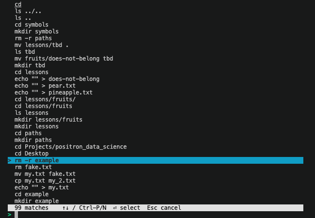

# Save your Terminal (zsh/bash) History!

A shared terminal history + fuzzy Ctrl-R picker for bash and zsh. Press **Ctrl-R** to open an interactive history browser — type to filter, navigate with arrows, select with Enter.



*requires Python 3+

## Install for zsh

1. Source the zsh script from your `~/.zshrc`:

   ```zsh
   source /path/to/terminal-history/terminal-history.zsh
   ```

2. Reload your shell:

   ```zsh
   source ~/.zshrc
   ```

## Install for bash

1. Source the bash script from your `~/.bashrc`:

   ```bash
   source /path/to/terminal-history/terminal-history.bash
   ```

2. Reload your shell:

   ```bash
   source ~/.bashrc
   ```

## Usage

| Key | Action |
|-----|--------|
| **Ctrl-R** | Open the history picker |
| Type | Filter history (fuzzy match by word) |
| ↑ / Ctrl-P | Move up |
| ↓ / Ctrl-N | Move down |
| Page Up / Page Down | Scroll by page |
| **Enter** | Select and paste into prompt |
| **Esc** / Ctrl-G | Cancel |
| Ctrl-U | Clear query |
| Ctrl-W | Delete previous word in query |

## What it does

- Increases history size (100k entries)
- Deduplicates history
- Shares history across all open terminal sessions in real time
- Replaces the default Ctrl-R with a full-screen curses picker with fuzzy matching and highlighted matches
